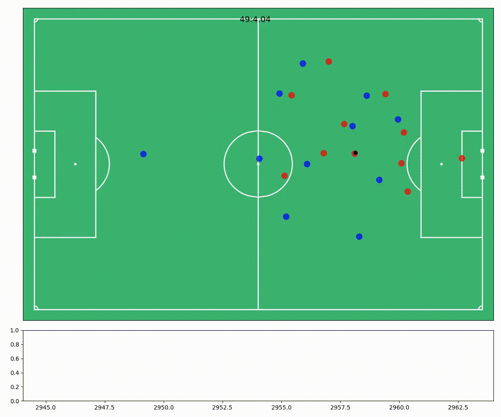

# Non-Shot-xG
Using a StatsBomb event based expected goals model with Metrica's tracking data to attribute non-shot-xG to every possession of each team.

## Why do they matter?
Goals, shots and expected goals are only counted if shots are actually taken.

## Problem
The problem is that there are some chances where a goal is likely but a player doesn’t shoot for some reason, they choose to pass, or hesitate etc.
How do we measure or quantify these Non-Shot chances?

